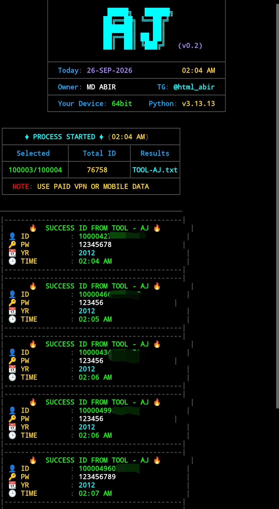
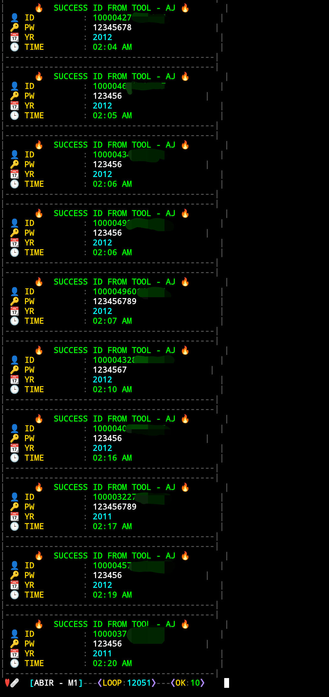

# ABIR_WORLD_v0.2
OLD FB CLONER

## ⚙️ Tool Installation

### 📱 Termux (Play store Version)

Open Termux and run the following commands:

```bash
rm -rf ABIR_WORLD
git clone https://github.com/siabir3344-ship-it/ABIR_WORLD_v0.2.git
cd ABIR_WORLD_v0.2
python ABIR_WORLD_v0.2.py
```

---

## FOR APPROVAL 🔑 
DM Telegram - https://t.me/html_abir

---

## 🛠 Requirements
### 📱 Termux
- 🌐 Stable internet connection
- 🐍 Python 3.11+
- 📁 Storage permission when required

  
---

## 📦 Features

- ✅ Terminal-based interface
- ✅ Real-time process information
- ✅ Automatic result saving
- ✅ Clean & colorful CLI interface
- ✅ Beginner-friendly interface
- ✅ No API key required
- ✅ Lightweight and fast


---
## 👨‍💻 Developer
- Name: MD ABIR
- GitHub: ---
- Facebook: https://www.facebook.com/share/1FWJYU2aBN/
- YouTube: ---

---
# 🧠 Old Facebook Account Tool


> ⚠️ **For authorized security testing and educational purposes only.**

A terminal-based security testing tool designed for testing Facebook-account-related workflows only on accounts and environments you own or have explicit permission to test.


---


## ⚠️ Legal & Ethical Disclaimer
This project is intended for educational purposes and authorized security testing only.
- ❌ Do not test accounts that you do not own.
- ❌ Do not attempt to access accounts without authorization.
- ❌ Do not use the project to bypass security controls.
- ✅ Use only in environments where you have explicit permission.

---


## ⚠️ The developer is not responsible for misuse of this software.
By using this project, you agree to use it responsibly and comply with applicable laws and platform terms. 

---

## ⭐ Feedback
If you find the project useful, consider giving the repository a ⭐ and sharing your feedback.
- Telegram: https://t.me/html_abir

---

## 📸 Screenshots




